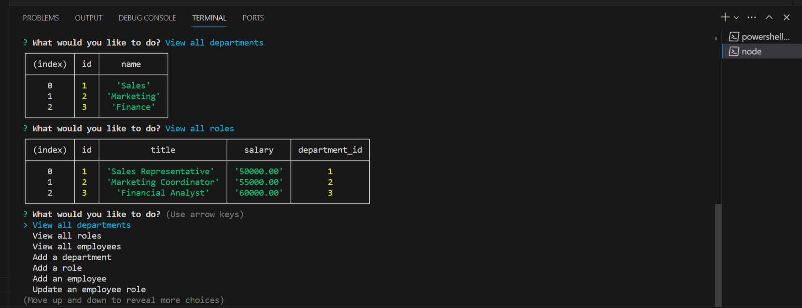

# Junipers SQL Employee Tracker

## Description
Efficiently manage your team with Juniper's SQL Employee Tracker. A straightforward solution for organizing and tracking employee information using SQL.

## Installation and Usage 

Before running this application be sure to follow the following instructions. 
1. Git clone this repo into your local device. 
2. Navigate into cloned local repo on your local device. 
3. Open local repo in code editor. 
4. Open integrated terminal.
5. Run NPM i in command line.
6. Install inquirer 8.2.4 by running the following command in the integrated terminal: [ npm i inquirer@8.2.4 ]
7. Set up local db
8. Seed db if desired 
9. Run application by running the following command in the integrated terminal :[ node server.js ]
10. Navigate the tracker by arrows. 

[Video Demonstration: How to install and use this application (run time 4:46)](https://drive.google.com/file/d/1ITeqT2yn9MVW296IuBpRRbtV7zGEr-ZV/view)

## Credits
This project includes starter code provided by UNCC Full-Stack Bootcamp.

## License
This project is licensed under the MIT license. 

## Questions
For any questions, please contact me at [JuniperWrenMcGill](https://github.com/JuniperWrenMcGill) or [email me](mailto:juniperwrenart@gmail.com ).
